# Architecture Documentation

This document provides a comprehensive overview of the Bootstrap Coder on Scaleway system architecture, including the **two-phase deployment strategy**, component relationships, CI/CD workflows, deployment flows, management scripts, hooks framework, and integration patterns with advanced GitHub Actions automation.

## System Overview

The Bootstrap Coder on Scaleway system is a multi-tier architecture designed for production-ready development environments with a **two-phase deployment strategy**. It combines infrastructure automation, platform orchestration, and workspace templating to deliver scalable development platforms with enhanced reliability and troubleshooting capabilities.

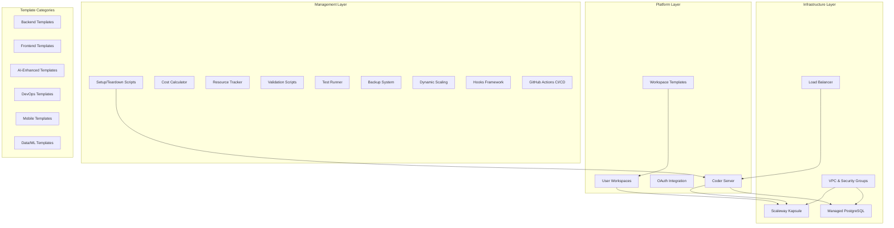

## Two-Phase Deployment Strategy

### Architecture Benefits

The system implements a **two-phase deployment approach** that provides significant advantages over monolithic deployment:

```mermaid
graph LR
    subgraph "Phase 1: Infrastructure"
        InfraStart[Start Infrastructure Deployment]
        Cluster[Deploy Kubernetes Cluster]
        Database[Provision PostgreSQL]
        Networking[Configure VPC & Security]
        KubeconfigReady[Upload Kubeconfig Artifact]
    end

    subgraph "Phase 2: Coder Application"
        CoderStart[Start Coder Deployment]
        RemoteState[Read Infrastructure State]
        ValidateStorage[Validate Storage Classes]
        DeployCoder[Deploy Coder Platform]
        DeployTemplates[Deploy Workspace Templates]
    end

    InfraStart --> Cluster
    Cluster --> Database
    Database --> Networking
    Networking --> KubeconfigReady

    KubeconfigReady --> CoderStart
    CoderStart --> RemoteState
    RemoteState --> ValidateStorage
    ValidateStorage --> DeployCoder
    DeployCoder --> DeployTemplates
```

### Key Advantages

1. **Enhanced Reliability**: Infrastructure failures don't prevent cluster access for troubleshooting
2. **Better Separation of Concerns**: Clear boundaries between infrastructure and application deployment
3. **Independent Retry Capability**: Failed Coder deployments can be retried without rebuilding infrastructure
4. **Immediate Troubleshooting Access**: Kubeconfig available immediately after Phase 1 completion
5. **Cleaner State Management**: Separate Terraform state files for infrastructure and application components

### Environment Structure

```
environments/
├── dev/
│   ├── infra/          # Phase 1: Infrastructure components
│   │   ├── main.tf     # Cluster, database, networking, security
│   │   ├── providers.tf # S3 backend: key="infra/terraform.tfstate"
│   │   └── outputs.tf  # Infrastructure outputs for Phase 2
│   └── coder/          # Phase 2: Coder application
│       ├── main.tf     # Coder deployment with remote state data source
│       ├── providers.tf # S3 backend: key="coder/terraform.tfstate"
│       └── outputs.tf  # Coder application outputs
├── staging/
│   ├── infra/
│   └── coder/
└── prod/
    ├── infra/
    └── coder/
```

## CI/CD & GitHub Actions Architecture

### GitHub Actions Workflow Architecture

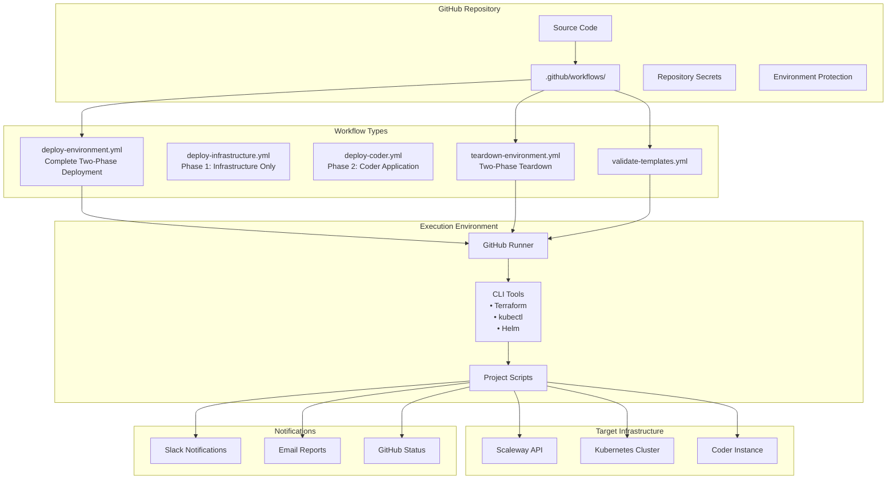

### CI/CD Pipeline Flow

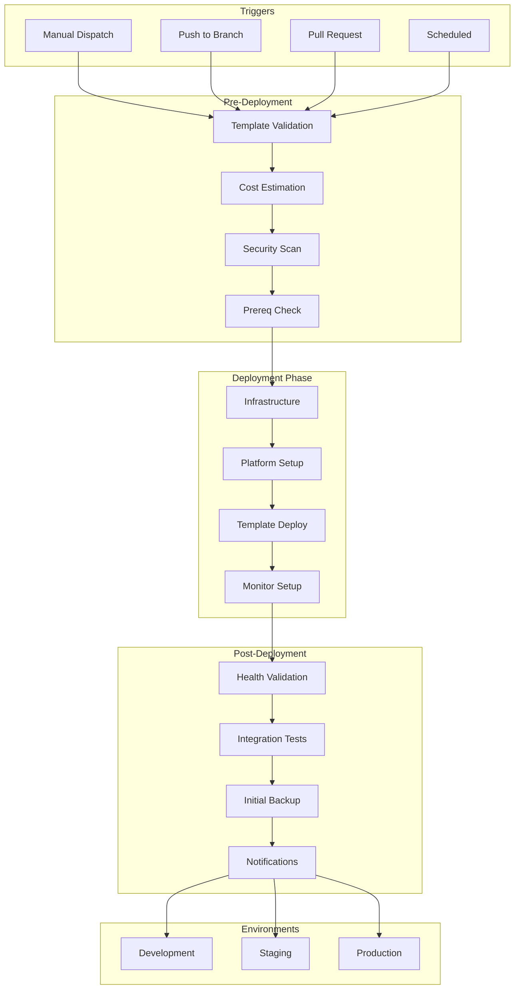

## Infrastructure Architecture

### Scaleway Resource Topology

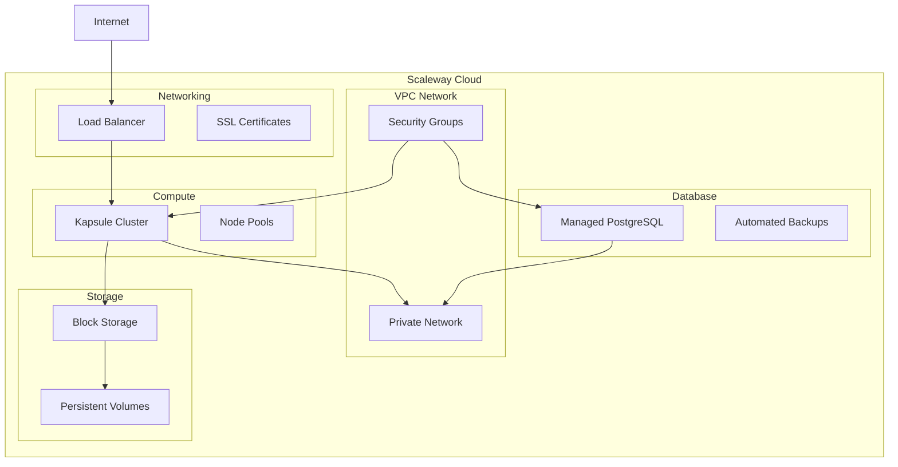

### Multi-Environment Configuration

| Environment | Nodes | CPU/Node | RAM/Node | Database | Monthly Cost |
|-------------|-------|----------|-----------|----------|--------------|
| Development | 2 | 1 vCPU | 2GB | DB-DEV-S | €53.70 |
| Staging | 3 | 2 vCPU | 4GB | DB-GP-S | €97.85 |
| Production | 5 | 4 vCPU | 8GB | DB-GP-M HA | €374.50 |

## Deployment Flow Architecture

### DevOps Deployment Sequence

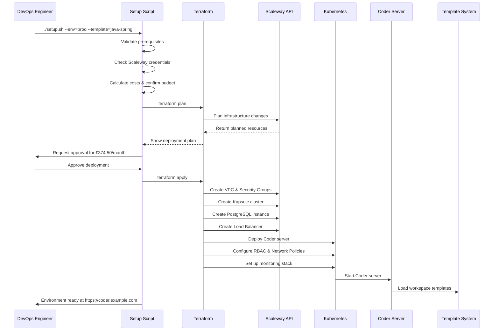

### Developer Workflow Sequence

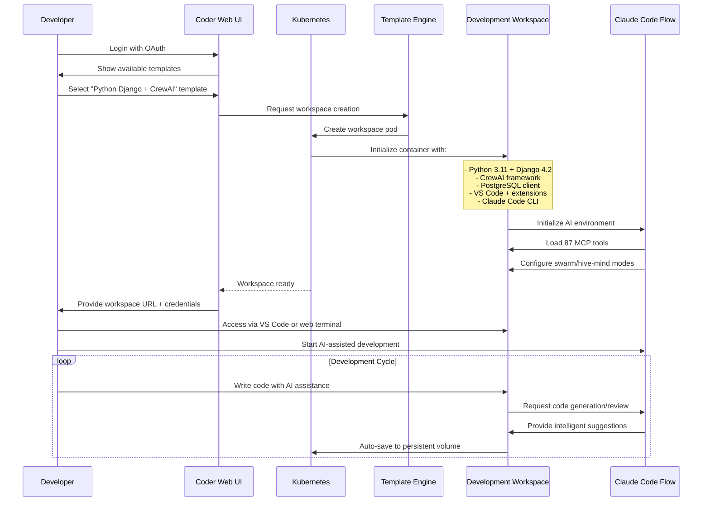

## Two-Phase Module Dependency Architecture

### Terraform Module Relationships

```mermaid
graph TB
    subgraph "Environment Configurations"
        subgraph "Development"
            DevInfra[environments/dev/infra/main.tf]
            DevCoder[environments/dev/coder/main.tf]
        end
        subgraph "Staging"
            StagingInfra[environments/staging/infra/main.tf]
            StagingCoder[environments/staging/coder/main.tf]
        end
        subgraph "Production"
            ProdInfra[environments/prod/infra/main.tf]
            ProdCoder[environments/prod/coder/main.tf]
        end
    end

    subgraph "Shared Resources"
        SharedVars[shared/variables.tf]
        SharedLocals[shared/locals.tf]
        SharedProviders[shared/providers.tf]
    end

    subgraph "Infrastructure Modules (Phase 1)"
        Networking[modules/networking]
        Cluster[modules/scaleway-cluster]
        Database[modules/postgresql]
        Security[modules/security]
    end

    subgraph "Application Modules (Phase 2)"
        CoderDeploy[modules/coder-deployment]
        RemoteState[terraform_remote_state.infra]
    end

    subgraph "Template System"
        BackendTemplates[templates/backend/*]
        FrontendTemplates[templates/frontend/*]
        AITemplates[templates/ai-enhanced/*]
        DevOpsTemplates[templates/devops/*]
        MobileTemplates[templates/mobile/*]
        DataMLTemplates[templates/data-ml/*]
    end

    DevInfra --> SharedVars
    StagingInfra --> SharedVars
    ProdInfra --> SharedVars

    DevInfra --> Networking
    DevInfra --> Cluster
    DevInfra --> Database
    DevInfra --> Security

    DevCoder --> RemoteState
    DevCoder --> CoderDeploy
    RemoteState -.->|"Reads infra outputs"| DevInfra

    Networking --> Cluster
    Networking --> Database
    Security --> Cluster

    CoderDeploy --> BackendTemplates
    CoderDeploy --> FrontendTemplates
    CoderDeploy --> AITemplates
    CoderDeploy --> DevOpsTemplates
    CoderDeploy --> MobileTemplates
    CoderDeploy --> DataMLTemplates
```

### Two-Phase Module Input/Output Flow

```mermaid
flowchart TD
    subgraph "Phase 1: Infrastructure Modules"
        subgraph "Networking Module"
            NetIn[Inputs:<br/>• region<br/>• environment<br/>• cidr_block]
            NetOut[Outputs:<br/>• vpc_id<br/>• private_network_id<br/>• security_group_ids]
        end

        subgraph "Cluster Module"
            ClusterIn[Inputs:<br/>• vpc_id<br/>• private_network_id<br/>• node_type<br/>• node_count]
            ClusterOut[Outputs:<br/>• cluster_id<br/>• kubeconfig<br/>• cluster_endpoint]
        end

        subgraph "PostgreSQL Module"
            DBIn[Inputs:<br/>• vpc_id<br/>• private_network_id<br/>• instance_type<br/>• backup_retention]
            DBOut[Outputs:<br/>• database_host<br/>• database_port<br/>• connection_string]
        end
    end

    subgraph "Remote State Bridge"
        S3Backend[S3 Backend Storage<br/>infra/terraform.tfstate]
        RemoteStateData[Remote State Data Source<br/>Reads infra outputs]
    end

    subgraph "Phase 2: Application Module"
        subgraph "Coder Module"
            CoderIn[Inputs (from remote state):<br/>• cluster_endpoint<br/>• database_host<br/>• kubeconfig<br/>• domain_name<br/>• oauth_config]
            CoderOut[Outputs:<br/>• coder_url<br/>• admin_credentials<br/>• workspace_templates]
        end
    end

    NetOut --> ClusterIn
    NetOut --> DBIn
    ClusterOut --> S3Backend
    DBOut --> S3Backend
    NetOut --> S3Backend

    S3Backend --> RemoteStateData
    RemoteStateData --> CoderIn
```

## Security Architecture

### Security Boundaries and Controls

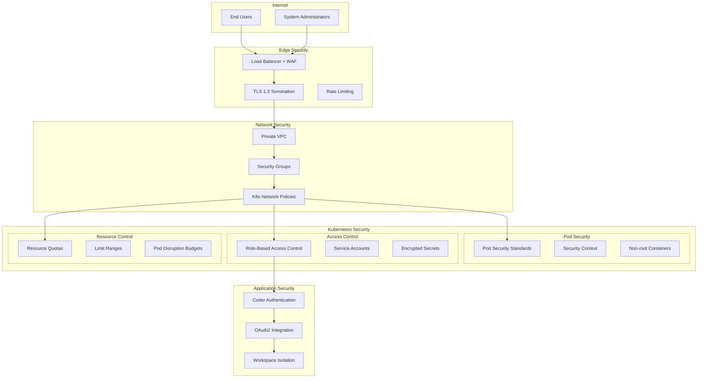

### RBAC Configuration

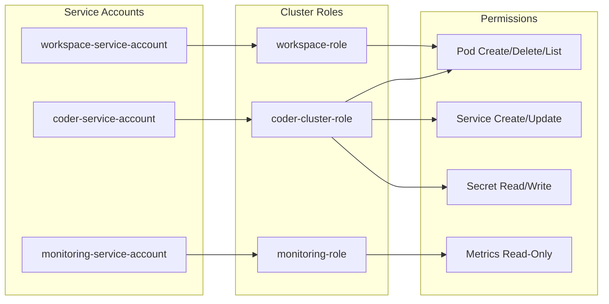

## Template System Architecture

### Template Categories and Relationships

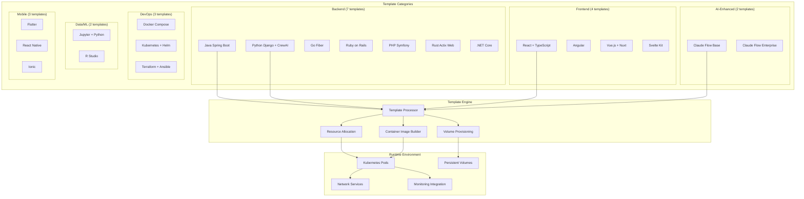

### Template Configuration Flow

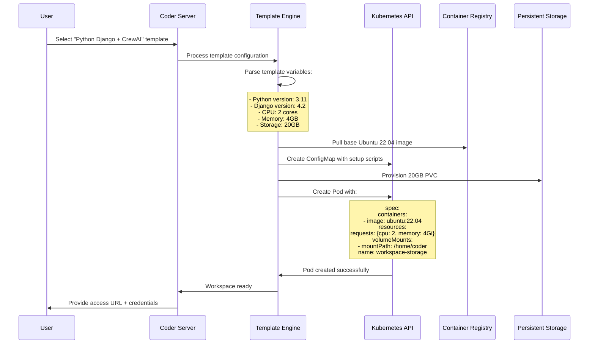

## Claude Code Flow Integration

### AI-Enhanced Development Architecture

```mermaid
graph TB
    subgraph "Claude Code Flow Environment"
        subgraph "MCP Tools (87 total)"
            FileOps[File Operations]
            GitOps[Git Integration]
            DockerOps[Docker Management]
            K8sOps[Kubernetes Operations]
            AITools[AI-Specific Tools]
            WebTools[Web Scraping & APIs]
        end

        subgraph "Operating Modes"
            SwarmMode[Swarm Mode<br/>Quick Tasks]
            HiveMindMode[Hive-Mind Mode<br/>Complex Projects]
        end

        subgraph "Development Stacks"
            FullStack[Full Stack<br/>Node.js + Python + Go]
            PythonAI[Python AI/ML<br/>TensorFlow + PyTorch]
            JSStack[JavaScript/TypeScript<br/>React + Node.js]
            SystemsStack[Go + Rust<br/>Systems Programming]
        end
    end

    subgraph "Integration Points"
        VSCode[VS Code Extensions]
        Terminal[Enhanced Terminal]
        Jupyter[Jupyter Integration]
        GitIntegration[Git Workflows]
    end

    subgraph "AI Capabilities"
        CodeGeneration[Code Generation]
        CodeReview[Automated Review]
        Documentation[Auto Documentation]
        Testing[Test Generation]
        Optimization[Performance Optimization]
    end

    SwarmMode --> FileOps
    SwarmMode --> GitOps
    HiveMindMode --> AITools
    HiveMindMode --> K8sOps

    FullStack --> VSCode
    PythonAI --> Jupyter
    JSStack --> Terminal
    SystemsStack --> GitIntegration

    VSCode --> CodeGeneration
    Terminal --> CodeReview
    Jupyter --> Documentation
    GitIntegration --> Testing
```

### AI-Assisted Development Workflow

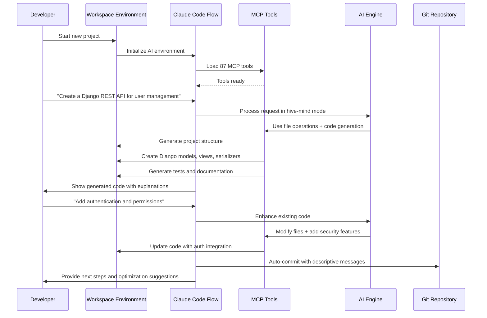

## Cost Management Architecture

### Cost Tracking and Budgeting Flow

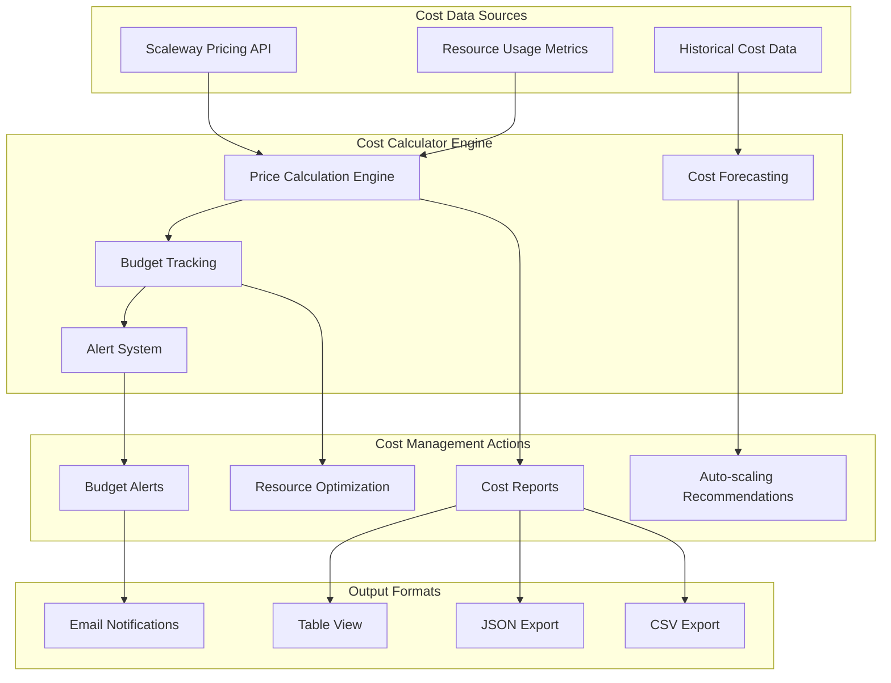

### Cost Calculation Workflow

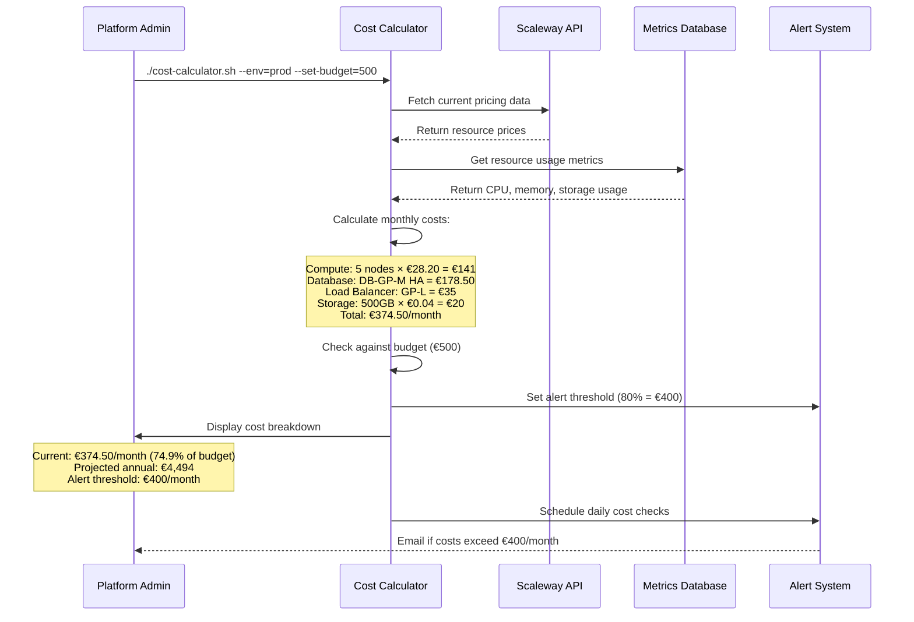

## Monitoring and Observability

### Monitoring Stack Architecture

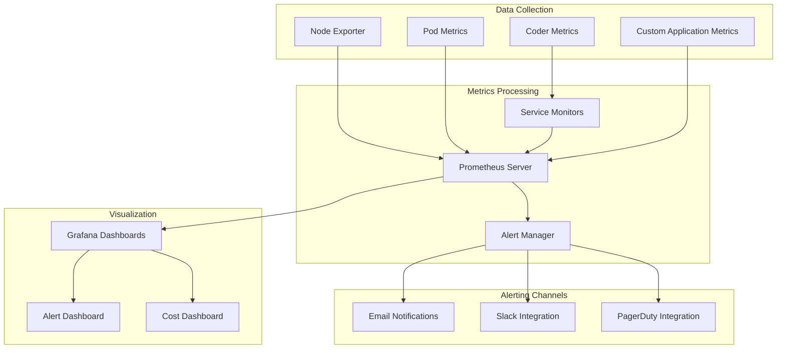

## Disaster Recovery and Backup Architecture

### Backup and Recovery Workflow

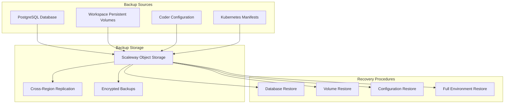

## Two-Phase Management Scripts Architecture

### Script Ecosystem Overview

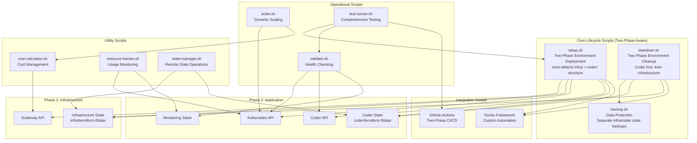

### Two-Phase Script Interaction Flow

```mermaid
sequenceDiagram
    participant User as User/CI
    participant Setup as Setup Script
    participant PreHook as Pre-Setup Hook
    participant InfraTF as Infrastructure Terraform
    participant CoderTF as Coder Terraform
    participant PostHook as Post-Setup Hook
    participant Validate as Validation
    participant Backup as Backup System

    User->>Setup: ./setup.sh --env=prod
    Setup->>Setup: Detect environment structure (infra/ + coder/)
    Setup->>Setup: Load configuration
    Setup->>PreHook: Execute pre-setup.sh
    PreHook-->>Setup: Pre-checks passed

    Note over Setup: Phase 1: Infrastructure Deployment
    Setup->>InfraTF: terraform plan (infra/)
    InfraTF-->>Setup: Infrastructure plan ready
    Setup->>User: Show cost estimate
    User->>Setup: Approve deployment

    Setup->>InfraTF: terraform apply (infra/)
    InfraTF-->>Setup: Infrastructure ready + kubeconfig

    Note over Setup: Phase 2: Coder Application Deployment
    Setup->>CoderTF: terraform plan (coder/)
    Note over CoderTF: Uses remote state to read infra outputs
    CoderTF-->>Setup: Coder application plan ready

    Setup->>CoderTF: terraform apply (coder/)
    CoderTF-->>Setup: Coder application ready

    Setup->>PostHook: Execute post-setup.sh
    PostHook->>Validate: Run health checks (both phases)
    Validate-->>PostHook: All systems healthy
    PostHook->>Backup: Create initial backup (separate states)
    Backup-->>PostHook: Backup completed
    PostHook-->>Setup: Post-setup complete

    Setup->>User: Complete environment ready
    Note over User: Kubeconfig available throughout for troubleshooting
```

## Hooks Framework Architecture

### Hooks Execution Architecture

```mermaid
graph TB
    subgraph "Hook Types"
        PreSetup[pre-setup.sh<br/>Before Deployment]
        PostSetup[post-setup.sh<br/>After Deployment]
        PreTeardown[pre-teardown.sh<br/>Before Cleanup]
        PostTeardown[post-teardown.sh<br/>After Cleanup]
    end

    subgraph "Hook Capabilities"
        Validation[Custom Validation]
        Notifications[Team Notifications]
        ExternalAPI[External API Calls]
        Compliance[Compliance Checks]
        Monitoring[Monitor Integration]
        Backup[Backup Operations]
    end

    subgraph "Integration Points"
        Slack[Slack/Teams]
        JIRA[JIRA/Ticketing]
        LDAP[LDAP/SSO]
        Vault[Vault/Secrets]
        Prometheus[Metrics Collection]
        Grafana[Dashboard Updates]
    end

    subgraph "Core Scripts"
        SetupScript[setup.sh]
        TeardownScript[teardown.sh]
    end

    SetupScript --> PreSetup
    PreSetup --> Validation
    PreSetup --> ExternalAPI
    PreSetup --> Compliance

    SetupScript --> PostSetup
    PostSetup --> Notifications
    PostSetup --> Monitoring
    PostSetup --> Backup

    TeardownScript --> PreTeardown
    PreTeardown --> Validation
    PreTeardown --> Backup

    TeardownScript --> PostTeardown
    PostTeardown --> Notifications
    PostTeardown --> ExternalAPI

    Notifications --> Slack
    Notifications --> JIRA
    ExternalAPI --> LDAP
    ExternalAPI --> Vault
    Monitoring --> Prometheus
    Monitoring --> Grafana
```

### Hook Environment and Context

```mermaid
flowchart TD
    subgraph "Environment Variables"
        EnvVars[ENVIRONMENT<br/>TEMPLATE<br/>PROJECT_ROOT]
        SystemVars[KUBECONFIG<br/>SCW_* credentials]
        CustomVars[Custom exports from hooks]
    end

    subgraph "Context Information"
        DeploymentContext[Deployment metadata]
        ResourceContext[Resource information]
        UserContext[User and timing info]
    end

    subgraph "Hook Execution"
        ValidationHooks[Validation Hooks]
        ActionHooks[Action Hooks]
        NotificationHooks[Notification Hooks]
    end

    subgraph "External Integrations"
        APIs[External APIs]
        Databases[External Databases]
        Services[External Services]
    end

    EnvVars --> ValidationHooks
    SystemVars --> ActionHooks
    CustomVars --> NotificationHooks

    DeploymentContext --> ValidationHooks
    ResourceContext --> ActionHooks
    UserContext --> NotificationHooks

    ValidationHooks --> APIs
    ActionHooks --> Databases
    NotificationHooks --> Services
```

This comprehensive architecture documentation provides detailed insights into all aspects of the Bootstrap Coder on Scaleway system, including the new GitHub Actions CI/CD integration, management scripts ecosystem, hooks framework, and advanced monitoring capabilities. Teams can use this documentation to understand system interactions, plan deployments, troubleshoot issues, and extend the platform with custom functionality.