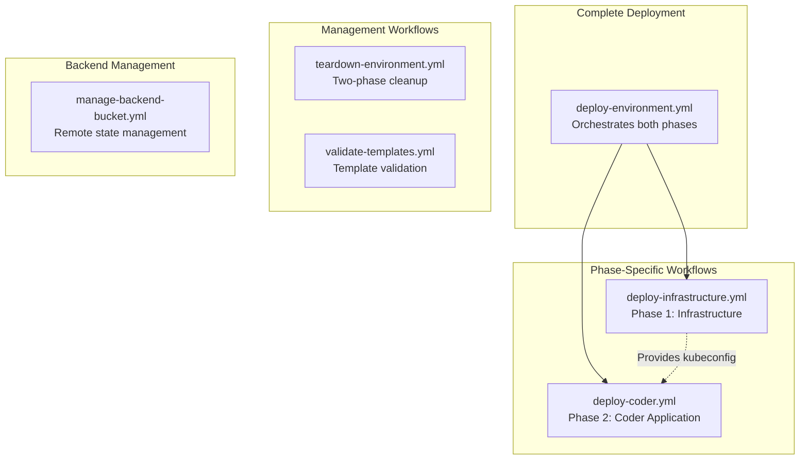

# GitHub Actions Workflows Documentation

This document provides comprehensive documentation for all GitHub Actions workflows in the Bootstrap Coder on Scaleway project, focusing on the **two-phase deployment architecture** and advanced automation capabilities.

## Table of Contents

1. [Overview](#overview)
2. [Two-Phase Deployment Workflows](#two-phase-deployment-workflows)
3. [Workflow Details](#workflow-details)
4. [Usage Examples](#usage-examples)
5. [Troubleshooting](#troubleshooting)
6. [Security Considerations](#security-considerations)

## Overview

### Workflow Architecture

The project implements a sophisticated CI/CD pipeline with multiple specialized workflows:



### Key Features

- **Two-Phase Deployment**: Infrastructure and application deployment separated for better reliability
- **Kubeconfig Artifacts**: Immediate cluster access after infrastructure deployment
- **Reusable Workflows**: Modular design for maintenance and extension
- **Comprehensive Error Handling**: Detailed failure reporting and recovery options
- **Security-First**: Minimal permissions, secret management, and secure defaults

## Two-Phase Deployment Workflows

### Complete Environment Deployment

**File**: `.github/workflows/deploy-environment.yml`

**Purpose**: Orchestrates complete environment deployment with both infrastructure and Coder application phases.

**Key Features**:
- Automatic phase orchestration
- Flexible trigger options (manual, PR, push)
- Comprehensive deployment summary
- Failure notifications and issue creation

**Triggers**:
```yaml
# Manual dispatch with full configuration options
workflow_dispatch:
  inputs:
    environment: [dev, staging, prod]
    template: string (optional)
    enable_monitoring: boolean
    auto_approve: boolean
    dry_run: boolean
    skip_coder_deployment: boolean

# Auto-deploy on PR with 'deploy-staging' label
pull_request:
  types: [opened, synchronize, labeled]

# Auto-deploy staging on main branch changes
push:
  branches: [main]
  paths: ['environments/staging/**', 'modules/**']
```

### Infrastructure Deployment (Phase 1)

**File**: `.github/workflows/deploy-infrastructure.yml`

**Purpose**: Deploys infrastructure components and uploads kubeconfig for immediate access.

**Components Deployed**:
- Kubernetes cluster (Scaleway Kapsule)
- Managed PostgreSQL database
- VPC networking and security groups
- Load balancer and SSL configuration
- **Kubeconfig artifact upload**

**Key Outputs**:
- Cluster endpoint and configuration
- Database connection details
- Network configuration
- **Kubeconfig file for troubleshooting**

### Coder Application Deployment (Phase 2)

**File**: `.github/workflows/deploy-coder.yml`

**Purpose**: Deploys Coder platform using infrastructure from Phase 1.

**Prerequisites**:
- Infrastructure deployment completed (Phase 1)
- Kubeconfig available (from artifacts or manual provision)
- Storage classes validated

**Components Deployed**:
- Coder server application
- OAuth integration
- Workspace templates (if specified)
- Health checks and validation

## Workflow Details

### 1. Complete Environment Deployment

```yaml
name: Deploy Complete Coder Environment
on:
  workflow_dispatch:
    # Comprehensive input options
  pull_request:
    # Automatic staging deployment
  push:
    # Auto-deploy staging changes
```

**Job Flow**:
1. **Strategy Determination**: Analyzes trigger and sets deployment parameters
2. **Infrastructure Phase**: Calls `deploy-infrastructure.yml`
3. **Coder Phase**: Calls `deploy-coder.yml` (if not skipped)
4. **Deployment Summary**: Comprehensive results and next steps
5. **Notifications**: Slack, email, and GitHub issue creation

**Usage Examples**:

```bash
# Complete development environment
gh workflow run deploy-environment.yml \
  -f environment=dev \
  -f template=python-django-crewai \
  -f enable_monitoring=false \
  -f auto_approve=true

# Production with monitoring (manual approval)
gh workflow run deploy-environment.yml \
  -f environment=prod \
  -f template=claude-flow-enterprise \
  -f enable_monitoring=true \
  -f auto_approve=false

# Infrastructure only (skip Coder deployment)
gh workflow run deploy-environment.yml \
  -f environment=staging \
  -f skip_coder_deployment=true
```

### 2. Infrastructure Deployment (Phase 1)

```yaml
name: Deploy Infrastructure (Phase 1)
on:
  workflow_call:
    # Called by complete deployment
  workflow_dispatch:
    # Manual infrastructure deployment
```

**Unique Features**:
- **Immediate Kubeconfig Upload**: Available as GitHub artifact
- **State Management**: Automatic backend setup if needed
- **Cost Validation**: Budget checks before deployment
- **Resource Validation**: Quota and limit verification

**Critical Step - Kubeconfig Upload**:
```yaml
- name: Upload Kubeconfig Artifact
  uses: actions/upload-artifact@v4
  with:
    name: kubeconfig-${{ inputs.environment }}
    path: ~/.kube/config-coder-${{ inputs.environment }}
    retention-days: 30
```

### 3. Coder Application Deployment (Phase 2)

```yaml
name: Deploy Coder Application (Phase 2)
on:
  workflow_call:
    # Called by complete deployment
  workflow_dispatch:
    # Manual Coder deployment
```

**Prerequisites Validation**:
- Infrastructure state verification
- Kubeconfig accessibility
- **Storage class validation** (prevents PVC failures)
- Resource availability checks

**Key Validation Step**:
```yaml
- name: Pre-deployment Cluster Validation
  run: |
    # Verify storage classes for PVC creation
    if kubectl get storageclass scw-bssd >/dev/null 2>&1; then
      echo "✅ scw-bssd storage class is available - PVC creation should succeed"
    else
      echo "❌ Required storage class not found"
      exit 1
    fi
```

### 4. Environment Teardown

```yaml
name: Teardown Environment
on:
  workflow_dispatch:
    inputs:
      environment: [dev, staging, prod]
      confirmation: string (required)
      create_backup: boolean
      teardown_mode: [complete, coder_only, infrastructure_only]
```

**Two-Phase Teardown Process**:
1. **Phase 2 Teardown**: Remove Coder application first
2. **Phase 1 Teardown**: Remove infrastructure last
3. **Backup Creation**: Optional pre-teardown backup
4. **State Cleanup**: Clean remote state files

**Safety Features**:
- **Confirmation Required**: Must provide exact confirmation string
- **Backup Options**: Automatic backup before destruction
- **Selective Teardown**: Choose specific phases to remove
- **State Discovery**: Automatically detects what's deployed

### 5. Template Validation

```yaml
name: Validate Templates and Infrastructure
on:
  workflow_dispatch:
  schedule:
    - cron: '0 6 * * 1'  # Weekly validation
  pull_request:
    paths: ['templates/**']
```

**Validation Scopes**:
- **Syntax**: Template configuration validation
- **Dependencies**: Template dependency checks
- **Deployment**: Full deployment testing
- **Comprehensive**: All validation types

### 6. Backend Management

```yaml
name: Manage Backend Bucket
on:
  workflow_dispatch:
    inputs:
      operation: [create, delete, list, backup]
      environment: [dev, staging, prod, all]
```

**Operations**:
- **Create**: Set up Terraform state backend
- **Delete**: Remove backend infrastructure
- **List**: Show existing backends
- **Backup**: Create state backups

## Usage Examples

### Development Workflow

```bash
# 1. Complete development environment
gh workflow run deploy-environment.yml \
  -f environment=dev \
  -f template=python-django-crewai \
  -f auto_approve=true

# 2. Add monitoring to existing environment
gh workflow run deploy-coder.yml \
  -f environment=dev \
  -f template=python-django-crewai \
  -f enable_monitoring=true

# 3. Clean up when done
gh workflow run teardown-environment.yml \
  -f environment=dev \
  -f confirmation="I understand this will destroy the environment" \
  -f create_backup=true
```

### Production Deployment

```bash
# 1. Infrastructure first (with manual verification)
gh workflow run deploy-infrastructure.yml \
  -f environment=prod \
  -f region=fr-par \
  -f availability_zone=fr-par-1

# 2. Verify infrastructure manually using kubeconfig
# Download artifact: kubeconfig-prod

# 3. Deploy Coder application
gh workflow run deploy-coder.yml \
  -f environment=prod \
  -f template=claude-flow-enterprise \
  -f enable_monitoring=true

# 4. Validate deployment
gh workflow run validate-templates.yml \
  -f validation_scope=comprehensive \
  -f environment=prod
```

### CI/CD Integration

```yaml
# .github/workflows/staging-cd.yml
name: Staging Continuous Deployment
on:
  push:
    branches: [main]
    paths: ['environments/staging/**', 'modules/**']

jobs:
  deploy-staging:
    runs-on: ubuntu-latest
    steps:
      - name: Deploy to Staging
        uses: ./.github/workflows/deploy-environment.yml
        with:
          environment: staging
          template: react-typescript
          enable_monitoring: true
          auto_approve: true
```

## Troubleshooting

### Common Failure Scenarios

#### 1. Infrastructure Deployment Failure (Phase 1)

**Symptoms**:
- No kubeconfig artifact created
- Scaleway resource creation errors
- Terraform state corruption

**Troubleshooting**:
```bash
# Check Scaleway console for partial resources
# Review deployment logs in GitHub Actions
# Verify Scaleway credentials and quotas

# Retry complete deployment
gh workflow run deploy-environment.yml \
  -f environment=dev \
  -f template=python-django-crewai
```

#### 2. Coder Deployment Failure (Phase 2)

**Symptoms**:
- Infrastructure deployed successfully
- Coder pods failing to start
- PVC creation errors

**Troubleshooting**:
```bash
# Download kubeconfig artifact from infrastructure deployment
export KUBECONFIG=./kubeconfig-dev

# Investigate cluster state
kubectl get nodes
kubectl get storageclass
kubectl get pods -n coder
kubectl describe deployment coder -n coder

# Check storage class availability
kubectl get storageclass scw-bssd

# Retry only Coder deployment
gh workflow run deploy-coder.yml \
  -f environment=dev \
  -f template=python-django-crewai
```

#### 3. Remote State Issues

**Symptoms**:
- State lock errors
- Backend not found errors
- Permission denied on state operations

**Troubleshooting**:
```bash
# Verify backend bucket exists
gh workflow run manage-backend-bucket.yml \
  -f operation=list \
  -f environment=dev

# Create backend if missing
gh workflow run manage-backend-bucket.yml \
  -f operation=create \
  -f environment=dev

# Force unlock if needed (use with caution)
# This requires manual Terraform operations
```

### Workflow Debugging

#### Enabling Debug Logging

Add these secrets to enable detailed logging:
- `ACTIONS_STEP_DEBUG=true`
- `ACTIONS_RUNNER_DEBUG=true`

#### Artifact Inspection

```bash
# Download artifacts from failed runs
gh run download <run-id>

# Key artifacts to examine:
# - kubeconfig-<env>: Cluster access
# - terraform-logs: Detailed Terraform output
# - deployment-summary: Comprehensive status
```

#### Manual Recovery

```bash
# If workflows fail, you can continue manually:

# 1. Download kubeconfig artifact
gh run download <run-id> -n kubeconfig-dev

# 2. Set kubeconfig
export KUBECONFIG=./kubeconfig-dev

# 3. Manual Terraform operations
cd environments/dev/coder
terraform init
terraform plan
terraform apply
```

## Security Considerations

### Workflow Permissions

All workflows use **minimal required permissions**:

```yaml
permissions:
  contents: read        # Repository access
  actions: read         # Artifact operations
  issues: write         # Issue creation on failure
  pull-requests: write  # PR comments
  id-token: write      # OIDC authentication
```

### Secret Management

**Required Secrets**:
- `SCW_ACCESS_KEY`: Scaleway API access key
- `SCW_SECRET_KEY`: Scaleway API secret key
- `SCW_DEFAULT_PROJECT_ID`: Scaleway project ID
- `SCW_DEFAULT_ORGANIZATION_ID`: Scaleway organization ID

**Optional Integration Secrets**:
- `SLACK_WEBHOOK_URL`: Slack notifications
- `NOTIFICATION_EMAIL`: Email alerts

### Automatic Deployment Control

The project uses a **feature flag** to control automatic staging deployments:

**Secret Name**: `ENABLE_AUTO_STAGING_DEPLOY`
- **Purpose**: Controls whether staging environment is automatically deployed on push/PR
- **Values**: Set to `"true"` to enable, any other value or unset to disable
- **Default**: Disabled (deployments are skipped if secret is not set)

**Configuration**:
1. Go to Settings → Secrets and variables → Actions
2. Add new repository secret: `ENABLE_AUTO_STAGING_DEPLOY`
3. Set value to `true` to enable automatic staging deployments

**Behavior**:
- When enabled: Push to main branch triggers staging deployment
- When disabled: Push events log skip message, manual deployment still works
- Pull requests with `deploy-staging` label also respect this setting
- Manual workflow_dispatch always works regardless of this setting

**Workflow Logs**:
The workflows will clearly log the deployment decision:
- `🚀 Auto staging deployment ENABLED - proceeding with deployment`
- `⏸️ Auto staging deployment DISABLED - skipping deployment`
- `💡 Set ENABLE_AUTO_STAGING_DEPLOY secret to 'true' to enable automatic deployments`

### Environment Protection

Production environments should use **GitHub Environment Protection**:
- Required reviewers for deployment approval
- Deployment restrictions (specific branches)
- Environment-specific secrets

```yaml
# Configure in GitHub repository settings
environment:
  name: production
  protection_rules:
    - required_reviewers: 2
    - allowed_branches: [main]
```

### State File Security

- **Encryption**: All state files encrypted at rest in Scaleway Object Storage
- **Access Control**: Environment-specific buckets with IAM policies
- **Versioning**: State file versioning enabled for rollback capability
- **Backup**: Automated state backups before major operations

---

This documentation provides comprehensive coverage of all GitHub Actions workflows in the project. For additional support, refer to the main [Usage Guide](USAGE.md) or create an issue in the repository.